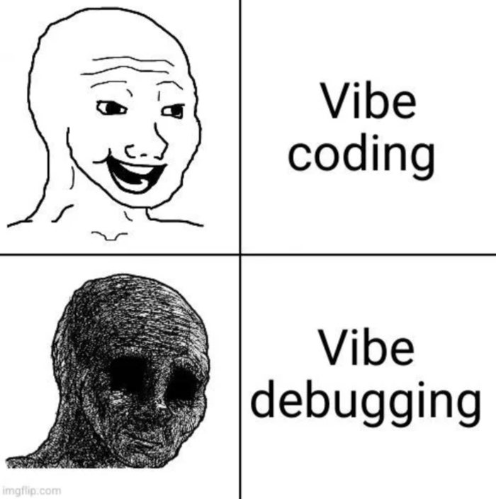

## My Vibe Debugging workflow
It can feel like magic. You write a few words outlining an idea you have for an application, and . . . POOF! . . . there it is. You can start using it right away. But then you start to notice bugs. Lots of bugs. And you spend hours and hours trying to track them down and kill them. Soon that sense of magic turns into a feeling of frustration. It doesn't help that Claude is an eternal optimist, always announcing that it has found the true source of the problem and has already fixed the problem, only to discover that nothing has changed and the bug is still there.. 

Even worse, you end up spending a lot of tokens on debugging, which means that Anthropic actually profits from writing terrible code. (No, I don't think this is intentional.) Not to mention wasting a lot of time running one test after another and getting nowhere.

Do not despair! There are some things you can do to improve the situation. Here are some tricks I've learned.

### Use worktrees
Don't debug on your main project, because if things go terribly wrong (as is common), you will have a difficult time rolling the code back, even if you are careful to save your project to git on a regular basis. Worktrees are much cleaner, and if you have multiple bugs you can open each one up in a separate worktree and then merge them back to the main project after you have verified the fix. [Here is a tutorial](https://inventivehq.com/knowledge-base/claude/how-to-use-git-worktrees) on how to use worktrees.

### One bug at a time

Never mention more than one bug at a time to Claude unless you are fairly sure that they are both symptoms of the same underlying problem. AI is easily overwhelmed by distracting information, you need to stay focused so it can stay focused. I have had situations where mentioning a related bug helped move things along, forcing Claude to look deeper in the code, but such situations are the exception rather than the rule. 

### Use skills

There are some skills that people have written that can help guide Claude to use more systematic debugging practices. My favorite is the [Superpowers plugin](https://github.com/obra/superpowers), written by Jesse Vincent who helped develp the Perl coding language. For coding projects for Apple, there is also an excellent [Swift Engineering plugin](https://github.com/johnrogers/claude-swift-engineering) that also includes debugging. 

### Gather data

Claude likes to just keep randomly trying whatever it thinks will work. For simple problems sometimes it can get it right the first time, so I often let it try once or twice before putting my foot down. After that, demand that it gather data by setting up debug logging to trace the problem. 

### Ask questions

Claude can also make false assumptions about the problem, the setup, or the user behavior that triggered the bug. Make it interview you about each of its assumptions to verify them before creating a plan.

### Force Claude to give you options

Claude often tries to save itself work, when you would rather the problem just get solved. Forcing it to list various strategies and ask you which one to pursue can help avoid that. Here is the prompt I use:

> Give me three options, one robust, one elegant, and a third parsimonious. Explain the benefits and drawbacks of each.

### Do research

Another problem is that Claude is constantly trying to reinvent the wheel. When its stuck it should do a web search to see if other people have encountered this problem and how they solved it.

### Write down what worked

I have Claude keep a "findings.md" document for each project. After each bug fix I have it record what worked there for future reference. 

### Have agents debate proposed solutions

Here is another prompt that I find useful. It has helped prevent wasted effort by showing why a proposed fix might not work.

> Have two agents debate your hypothesis about the cause of the bug. One will defend the hypothesis and martial evidence from the code and logs to support their position. The other will attempt to poke holes in the argument by highlighting all the ways it might be wrong. A third agent will act as judge, ending the discussion once it seems clear that one side has won decisively. 

### Give it to another AI

Sometimes Claude just seems studk, it might help to feed the code to OpenAI or even an opensource LLM just to get a different perspective. When their suggestions are fed back to Claude it sometimes provokes some creative thinking. 

