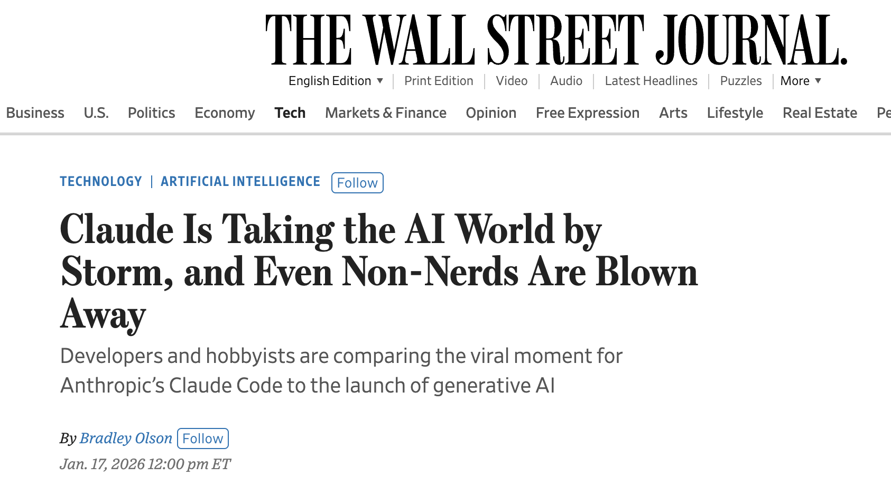

## Two recent news stories about people like me

First, [the WSJ](https://archive.ph/2bU0Y):

> The Claude zeal has spread widely this month, even to non-engineers. Many took to social media to describe the process of building their first software program without ever having learned to code. And despite the “code” in the name, people are using Claude Code for everything from health-data analysis to expense-report compiling as well.

And [The Atlantic](https://archive.ph/LqEAX#selection-801.0-805.76):

> The bot’s popularity truly exploded late last month. A recent model update improved the tool’s capabilities, and with a surplus of free ti me over winter break, seemingly everyone in tech was using Claude Code. “You spent your holidays with your family?” wrote one tech-policy expert. “That’s nice I spent my holidays with Claude Code.”
