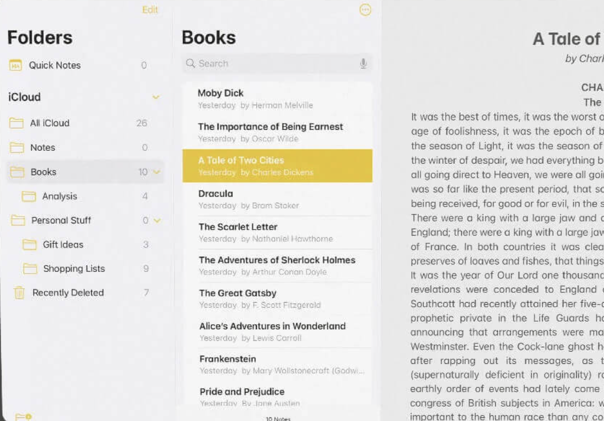
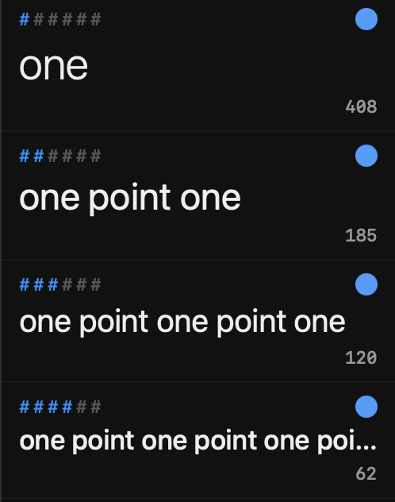

My big vibe-coding project is a word processor for academics. In addition to writing about coding, I also want to write about some of the design decisions that have gone into my app. This is the first post in that series.

How do you display hierarchy in a word processing app? Let's start by taking a look at how Apple Notes does it:



I start here, because this is a pretty standard interface for lots of apps. A folder pane, a note pane, and then the document to the right. But that means that your folder and note list are taking up more than 1/3 of the screen! I find this solution unacceptable for a writing app. 

It is also unnecessary, because you just need the outline of your current document, not all your various writing projects. Some apps handle this with a menu option that let's you navigate your document outline by header, or have a dedicated outline view, but for me the outline should be a central feature of the app. I want to be able to quickly get a sense of where I am in the document and how the section I'm working on relates to the document as a whole. I also want to be able to jump between sections easily, and even re-order them. But how to do this? 

One problem is that outlines display hierarchical information spatially. Each sub-node is usually shifted to the right, like so:

- First level
  - Second level
    - Third level
      - Fourth level
      

The problem with this is that it only works if the outline takes up the full width of the screen. If you want the main part of the screen to be where you actually edit your document, you have to keep the outline side-panel pretty narrow, which makes indenting difficult. 

There is a way to show indentation without taking up quite as much space. For instance, you might use vertical lines:

```
| First level
|| Second level
||| Third level
|||| Fourth level
```

It works, but isn't the most elegant solution. Lots of vertical lines next to each other stop being easily distinguishable unless you focus very hard on them. 

Another way to do it is by font size. 

# First level

## Second level

### Third level

#### Fourth level

That's a bit better, but the top levels end up taking up quite a bit of horizontal and vertical space, and smaller levels can be hard to read. I perfer IBM's [Carbon Design typography](https://carbondesignsystem.com/elements/typography/type-sets/) approach where the top levels are thinner and the lower ones are in bold. 

But wait, can we bring in something of the vertical line approach? How about taking a tip from [markdown](https://en.wikipedia.org/wiki/Markdown) formatting, where each header level is marked by a series of hash marks # = top level header, ## second, ### third, etc. and placed this ABOVE the text instead of to the left of it? 

This is the solution I have gone with in my app, which has a single (collapsable) navigation sidebar that combines Carbon Design typography with ### headings. 



The numbers on the bottom right are per-section word counts. I'll talk about the blue dots another time.

