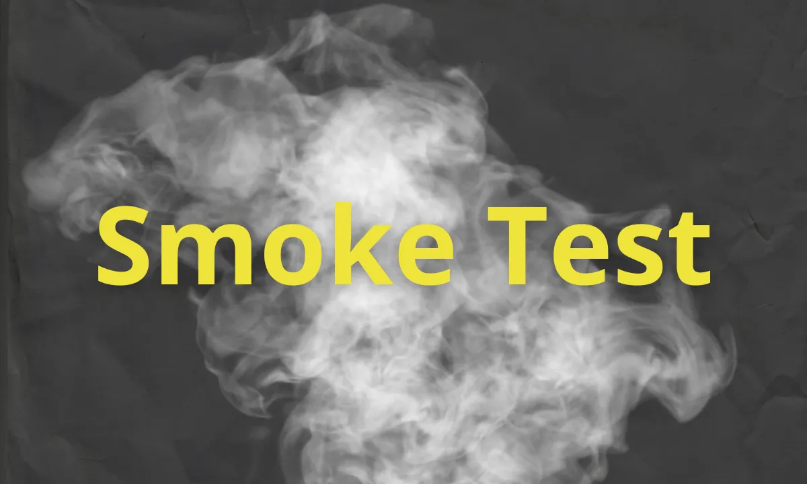

As I mentioned before, one of the most frustrating aspects of vibe-coding is [[debugging]], but what I didn't discuss is catching the bugs in the first place. Running tests on your code helps ensure that changes didn't break anything. And when you do fix something, they make sure that you didn't break something else in the process.

The most basic kind of test is called a "smoke test." [Wikipedia gives the etemology](https://en.wikipedia.org/wiki/Smoke_testing_(software)#Etymology):

>  The term originates from the centuries-old practice of mechanical smoke testing, where smoke was pumped into pipes or machinery to identify leaks, defects, or disconnections. Widely used in plumbing and industrial applications, this method revealed problem areas by observing where smoke escaped.

> In software development, the term was metaphorically adopted to describe a preliminary round of testing that checks for basic functionality. Like its physical counterparts, a software smoke test aims to identify critical failures early, ensuring the system is stable and that all required components are functioning before proceeding to more comprehensive testing, such as end-to-end or load testing.

## How I use smoke tests:

The word processor I'm building is a macOS app with a SwiftUI shell, a SQLite database, and web-based editors running in WKWebView. It has a lot of moving parts — custom URL schemes, JavaScript bridges, database migrations, sidebar state. A failure in any of these can mean the app launches to a blank screen or crashes silently.

My smoke tests are split into two groups: **launch tests** and **editor tests**.

The launch tests are the simplest possible checks. One test just launches the app and verifies that a window appears. Another checks that when there's no existing project, the app shows a project picker with "New Project" and "Open Project" buttons. These tests don't need any test data — they just confirm the app boots into a valid state.

The editor tests go one step further. They use a pre-built test fixture — a small SQLite database with sample content — that gets copied into a temporary location before each test. The app detects it's running in test mode via environment variables, bypasses the normal project picker, and opens the fixture directly. From there, the tests verify core functionality:

- **Does the editor load?** The test waits for the editor area and word count to appear in the status bar.
- **Does mode switching work?** A keyboard shortcut (Cmd+/) should toggle between the WYSIWYG and source editors, and the status bar should reflect the change.
- **Do the sidebars toggle?** Another shortcut (Cmd+[) should show and hide the outline sidebar.
- **Does focus mode work?** Cmd+Shift+F should hide the status bar and dim non-active paragraphs; Escape should exit.

Each test takes a few seconds. The full suite runs in about 40 seconds. That's fast enough to run on every commit.

Smoke tests are the pure minimum. I still have to manually check that the app is working, but these serve an important purpose: they answer the question, **does this thing basically work?** If the answer is no, nothing else matters yet. They are simple enough and fast enough that I can leave it to the AI to run them and then check out more complex user-interactions myself. 

## How to do testing in Swift

I didn't realize this when I started, but Apple's XCode allows you to run an app, open windows, even take screenshots for analysis, via the command line. Here is some [documentation](https://developer.apple.com/documentation/xcuiautomation) on this from apple. I also used the [Axiom](https://github.com/charleswiltgen/axiom) plugin to help teach Claude how to do this. If I'd figured this out earlier it would have saved me a lot of headaches!
