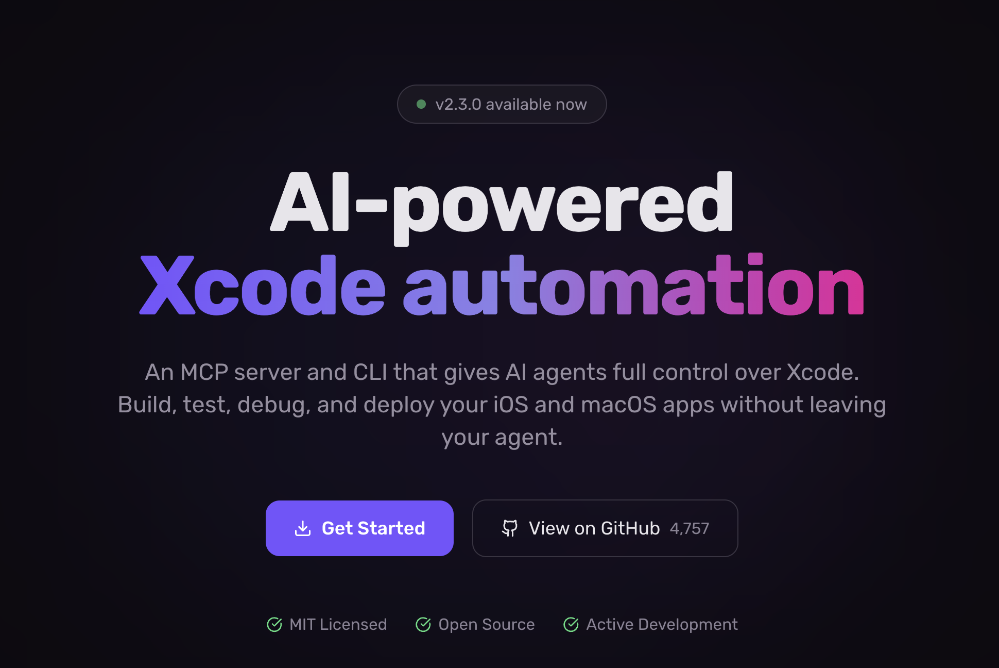

I've been struggling to get Claude to run tests reliably using Apple's official [Xcode MCP server](https://developer.apple.com/documentation/xcode/giving-agentic-coding-tools-access-to-xcode). It required constant hand-holding — watching over the process, intervening when things stalled, and often just giving up and running tests manually. Not exactly the "agentic" workflow I was hoping for.

Then I switched to [XcodeBuild MCP](https://github.com/nicklama/xcodebuild-mcp) and the difference was night and day. Tests just work. I can kick them off and walk away. Sam Wize has a [great writeup](https://samwize.com/2026/03/11/i-tried-apple-xcode-mcp-and-xcodebuild-mcp-only-one-feels-complete/) comparing the two and explaining how and why he uses each one.
