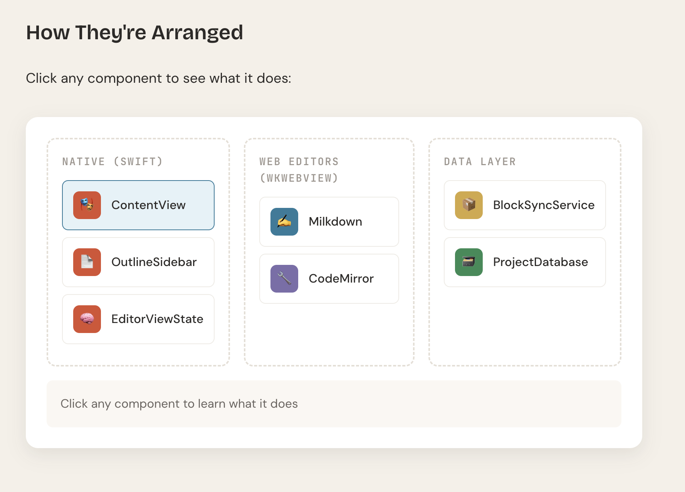

[Codebase to Course](https://github.com/zarazhangrui/codebase-to-course) is a neat skill which takes any codebase and generates a self-contained, interactive HTML page that teaches how the code works. It is designed to help vibe coders better understand their own project and how it works. 

I ran it on [FINAL|FINAL](https://finalfinalapp.cc/), removing the interactive quizzes and such. The result is a single-page document that walks through the app's architecture, from the SwiftUI shell down to the SQLite persistence layer. You can view it here:

[How FINAL|FINAL Works Under the Hood](/final-final-course.html)

It is useful for anyone who wants to modify the code, and if you have your own project that you vibe coded it can help you better understand what you've built.
